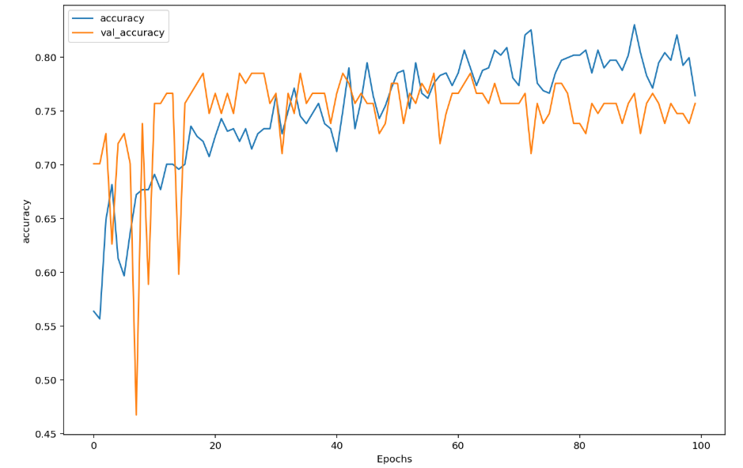
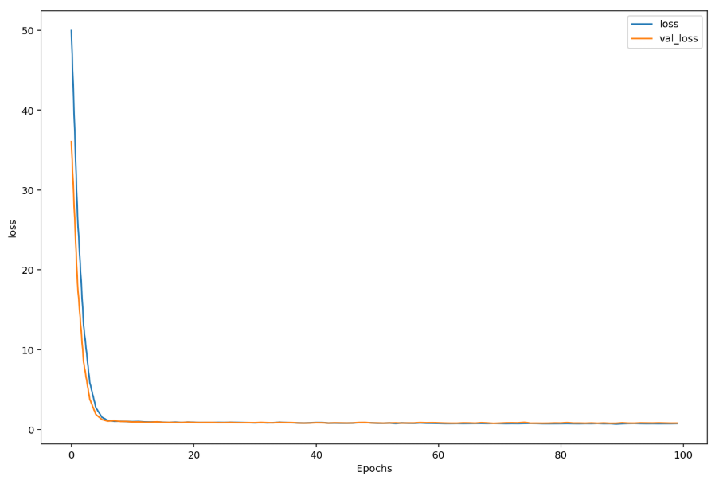
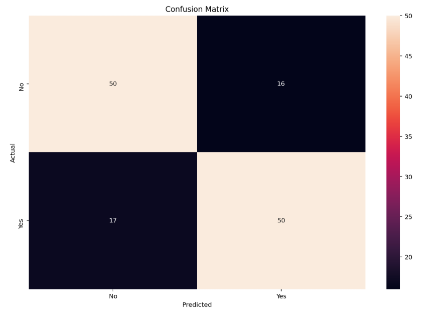

# Cutomer-loan-enquiry
The objective of this project is to predict if a customer will get a loan given applicant income, loan amount, loan amount term, credit history, education status, self-employment status, property area, etc. A model is trained using the training data on previous customers' loan approval history. A web service is created, which runs the trained model in the background. The service presents an interface through which any user can request to get an automated decision/prediction (i.e., chances of approval or rejection). In addition, the web service also provides a REST API, which can be used to get all the customer information. Later, additional customer information can be leveraged to train a bigger model. 

• The web service is developed using the Django framework & REST API.  
• To build the model, Tensorflow 2.0 is used.  
• SMOTE is used to oversample the minority class (i.e., loan rejection). 
• The data is normalized and preprocessed.  
• The model is trained using a FFN with 4 dense layers (adding L1 regularization) and 2 dropout layers.  
• The model has an accuracy of 80%.  

# Performance:

# How to run:
To check the model please open the following file: 
> Customer_Loan.ipynb  
 
To run the web service, go inside the Django-app directory and run the following commands: 
> pip install requirements.txt  
> python manage.py makemigrations  
> python manage.py migrate 
> python manage.py runserver 
 
Go to the localhost usning any web browser.  
http://127.0.0.1:8000/ 

To get all the customer information from the server go to the following urls:  
http://127.0.0.1:8000/api/myapi/  

